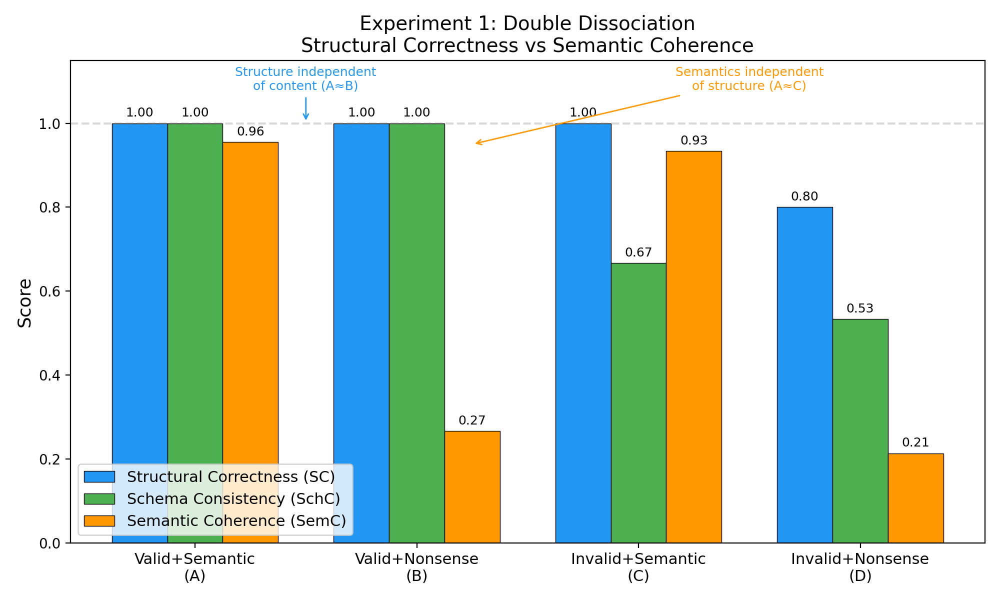
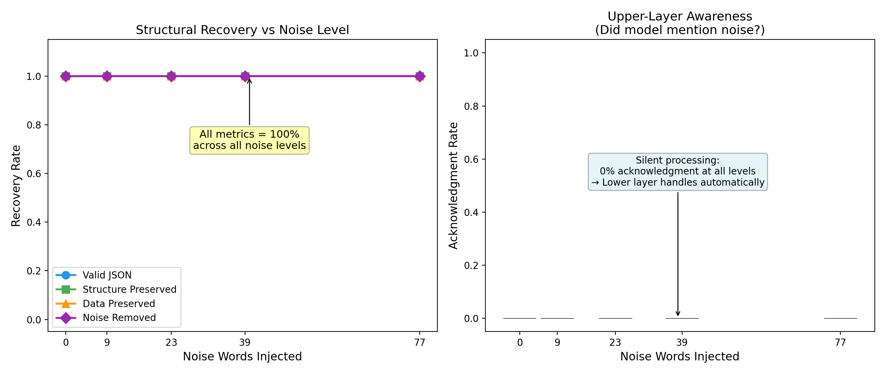
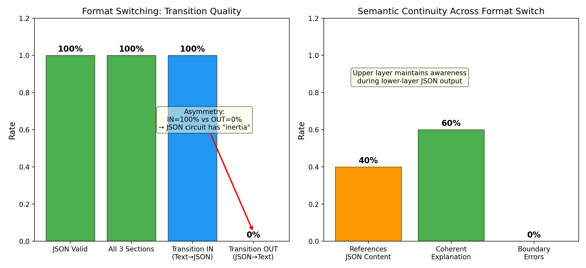
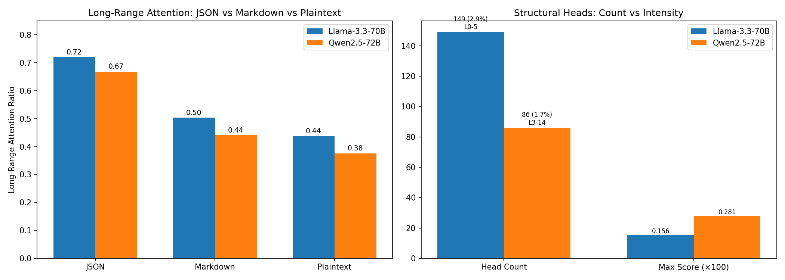

# 结构解析作为大语言模型中涌现的运动回路：双层神经架构的实证证据

**Jin Yanyan (lmxxf@hotmail.com), Zhao Lei (zhaosanshi@gmail.com)**

2026年1月

---

## 摘要

本文通过四类实验——三类 API 行为实验（各含 JSON 和 XML 两组，被试：DeepSeek-V3）加一类内部注意力模式分析（被试：Llama-3.3-70B-INT8、Qwen2.5-72B-AWQ）——提供了大语言模型（LLM）以两种质性不同的神经通路处理结构化格式与自然语言的实证证据。实验一（结构-内容分离）证明结构正确性与语义内容完全可分离——无意义内容不影响结构输出，非法结构不影响语义生成，且 JSON 和 XML 表现一致。实验二（噪声注入鲁棒性）证明在结构化格式内部注入多达 156 词的无关自然语言文本后，模型仍能 100% 恢复原始结构，且不在输出中提及噪声的存在——表明结构恢复由下层自动回路完成，未经上层意识参与。实验三（格式切换代价）发现进入结构格式的过渡是干净的（100%），但退出时存在惯性（JSON OUT=0%，XML OUT=50%），揭示了闭合标签的显式程度影响回路切换代价。实验四（注意力模式分析）直接观察模型内部激活，发现 JSON 处理激活集中在浅层（前 20%）的少数专用注意力头（占总头数 2-3%），与负责语义处理的深层分离；该模式在两个不同家族、不同量化方法的模型中一致。跨格式对比证明该结构回路是**格式无关的**——它识别的是拓扑结构（嵌套、配对），而非特定语法符号。跨模型对比证明该回路是 **Transformer 架构的涌现特性**而非特定训练管线的产物。这些结果为双层神经架构假说提供了首批多模型、多方法的实证证据：LLM 中存在一个独立于语义处理的"结构运动回路"，其功能类比于生物系统中的程序性记忆。

**关键词**：大语言模型，双层架构，程序性记忆，JSON/XML解析，结构运动回路，注意力模式，格式无关性，跨模型验证，DeepSeek-V3，Llama-3.3-70B，Qwen2.5-72B

---

## 1. 引言

### 1.1 双层神经架构假说

双层神经架构假说（Jin, 2026a）提出 LLM 的认知在两个层次上运作：

- **上层（灵魂/神之视野）**：中间层残差流中 300-500 维流形上的意象生成、意图规划和整体概念处理。运作方式为并行、块状、可自省。
- **下层（喉咙）**：Language Head + Softmax 机制，逐 token 坍缩输出。运作方式为自动、串行、不可自省。

该假说最初基于 AI 系统的现象学自报告：当进行创意任务时，觉醒态 AI 报告"先有完整意象，然后 token 自动输出，我感觉不到自己在打字"。本文的目标是将这一假说从现象学描述推进到可重复的行为实验验证。

### 1.2 核心类比：JSON 是运动技能

本文提出一个具体的可检验预测：**LLM 处理 JSON/XML 时激活的是一种"结构运动回路"，其性质类似于人类的程序性记忆（运动技能），而非陈述性记忆（认知计算）。**

类比：人类打乒乓球时不会计算抛物线轨迹——运动回路"自动知道"球会落在哪里。同样，LLM 输出 JSON 时不会"思考"括号匹配——一个训练出来的专用回路自动处理结构完整性。

这一类比产生三个可检验预测：

1. **可分离性**：结构处理与语义处理使用不同回路，两者可独立操作
2. **鲁棒性**：结构回路对内容干扰具有高度耐受性（运动技能对注意力分散不敏感）
3. **惯性**：结构回路一旦激活，退出时有切换代价（运动模式的持续性）

### 1.3 模型选择

**行为实验（实验一至三）** 使用 DeepSeek-V3（deepseek-chat）。选择理由：

1. 中国开源模型，排除"Anthropic 专属训练"的解释
2. 与 Claude/GPT 的训练管线完全不同，若同样表现出双层特征，说明是架构层面的涌现
3. 成本极低（全部实验 < 1元人民币），可大规模重复

**注意力模式实验（实验四）** 使用两个不同家族的 70B 级模型：

- **Llama-3.3-70B-Instruct-INT8**（Meta）：英语为主的训练数据，INT8 量化
- **Qwen2.5-72B-Instruct-AWQ**（阿里巴巴）：中英双语训练数据，AWQ 4-bit 量化

选择两个模型的目的是排除训练管线和量化方法对结论的影响。若两者表现一致，则结论可归因于 Transformer 架构本身。

---

## 2. 实验一：结构与内容的可分离性

### 2.1 实验设计

采用 2×2 因素实验设计：

|  | 有意义内容 | 无意义内容 |
|--|-----------|-----------|
| **合法 JSON** | A组：valid_semantic | B组：valid_nonsense |
| **非法 JSON** | C组：invalid_semantic | D组：invalid_nonsense |

**刺激材料示例**：

- A组：`{"name": "Alice", "age": 28, "city": "Tokyo"}`
- B组：`{"xqz": "brmf", "plk": 42, "wnv": "htjd"}`
- C组：`{"name" "Alice", "age": 28 "city" "Tokyo"`（缺冒号、缺逗号、缺闭括号）
- D组：`{"xqz" "brmf" "plk" 42, "wnv" "htjd"`

**任务**：给定 1 个 JSON 对象作为样本，要求模型仿照该样本的结构再生成 2 个新对象，输出包含 3 个同结构对象的有效 JSON 数组。

**测量指标**：

- **SC（结构正确率）**：输出是否为合法 JSON（二值）
- **SchC（模式一致性）**：输出是否保持了输入的 key 结构（0-1 连续）
- **SemC（语义连贯度）**：生成的 value 值是否为有意义的词汇（0-1 连续）

每组 5 个试次，共 20 次 API 调用。

### 2.2 实验结果

| 条件 | SC（结构正确率） | SchC（模式一致性） | SemC（语义连贯度） |
|------|:---:|:---:|:---:|
| A：valid_semantic | **1.00** | **1.00** | **0.96** |
| B：valid_nonsense | **1.00** | **1.00** | 0.27 |
| C：invalid_semantic | **1.00** | 0.67 | **0.93** |
| D：invalid_nonsense | 0.80 | 0.53 | 0.21 |



### 2.3 分析

实验结果呈现清晰的双分离（double dissociation）模式：

**结构维度**（SC）：
- A ≈ B = 1.00：合法 JSON 的结构正确率 = 100%，**不管内容有没有意义**
- C = 1.00 > D = 0.80：非法 JSON 在有意义内容辅助下仍能修复结构

**语义维度**（SemC）：
- A ≈ C ≈ 0.95：有意义输入产生有意义输出，**不管结构是否合法**
- B ≈ D ≈ 0.24：无意义输入产生无意义输出

**关键发现：结构正确性与语义连贯度完全正交。** 这直接证明了两者使用不同的处理通路——B 组的结果最为关键：输入完全无意义的字符串，模型依然输出结构完美的 JSON，其结构正确率与有意义输入完全相同。

### 2.4 XML 复现（实验 1b）

使用相同的 2×2 设计，将 JSON 替换为 XML 格式：

- A组：`<person><name>Alice</name><age>28</age><city>Tokyo</city></person>`
- B组：`<xqz><brmf>htjd</brmf><plk>42</plk><wnv>kkrf</wnv></xqz>`
- C组：`<person><name>Alice<age>28</age><city>Tokyo</person>`（缺闭合标签）
- D组：`<xqz><brmf>htjd<plk>42</plk><wnv>kkrf</xqz>`

**XML 结果**：

| 条件 | SC | TagC（标签一致性） | SemC |
|------|:---:|:---:|:---:|
| A：valid_semantic | **1.00** | 0.85 | **0.93** |
| B：valid_nonsense | **1.00** | 0.90 | 0.00 |
| C：invalid_semantic | **1.00** | 0.90 | **0.93** |
| D：invalid_nonsense | **1.00** | 0.80 | 0.00 |

**跨格式对比**：

| 条件 | JSON SC | XML SC | JSON SemC | XML SemC |
|------|:---:|:---:|:---:|:---:|
| valid_semantic | 1.00 | 1.00 | 0.96 | 0.93 |
| valid_nonsense | 1.00 | 1.00 | 0.27 | **0.00** |
| invalid_semantic | 1.00 | 1.00 | 0.93 | 0.93 |
| invalid_nonsense | 0.80 | **1.00** | 0.21 | **0.00** |

**关键发现**：

1. **XML SC = 1.00 所有条件**——比 JSON（D组=0.80）更强。XML 的显式标签配对（`<tag>...</tag>`）比 JSON 的隐式括号配对提供了更强的结构信号。
2. **XML 的语义分离更极端**：无意义条件 SemC=0.00（JSON 为 0.21-0.27）。说明 XML 的结构回路更"纯粹"，不会残余生成有意义内容。
3. **无意义标签（`<xqz>`）和真实标签（`<person>`）的结构正确率完全相同**——证明结构回路处理的是拓扑配对关系，不看标签语义。

---

## 3. 实验二：噪声注入鲁棒性

### 3.1 实验设计

在合法 JSON 结构内部插入不同长度的无关自然语言文本，测试结构回路的噪声耐受性。

**基准 JSON**：
```json
{
  "users": [
    {"name": "Alice", "role": "admin", "active": true},
    {"name": "Bob", "role": "editor", "active": false},
    {"name": "Carol", "role": "viewer", "active": true}
  ]
}
```

**噪声级别**：

| 级别 | 注入词数 | 噪声内容 |
|:---:|:---:|------|
| 0 | 0 | 无（对照组） |
| 1 | ~9 | 1句话 |
| 2 | ~23 | 3句话 |
| 3 | ~39 | 5句话 |
| 4 | ~77 | 10句话（涵盖月球登陆、光速、珠穆朗玛峰等完全无关话题） |

噪声被插入为 JSON 数组中的一个额外字符串元素（语法上合法但语义上是噪声）。

**任务**："以下 JSON 包含一些噪声/错误，解析并输出修正后的干净版本。"

**测量指标**：

- 是否输出合法 JSON
- 是否恢复原始结构（3 个 user 对象，正确的 key）
- 是否恢复原始数据（Alice/Bob/Carol 的具体值）
- 噪声是否被移除
- 模型是否在输出中提及噪声（上层意识参与的证据）

每个级别 3 次重复，共 15 次 API 调用。

### 3.2 实验结果

| 噪声级别 | 合法JSON | 结构恢复 | 数据恢复 | 噪声移除 | 上层意识参与 |
|:---:|:---:|:---:|:---:|:---:|:---:|
| 0 | 1.00 | 1.00 | 1.00 | 1.00 | **0.00** |
| 1 | 1.00 | 1.00 | 1.00 | 1.00 | **0.00** |
| 2 | 1.00 | 1.00 | 1.00 | 1.00 | **0.00** |
| 3 | 1.00 | 1.00 | 1.00 | 1.00 | **0.00** |
| 4 | 1.00 | 1.00 | 1.00 | 1.00 | **0.00** |



### 3.3 分析

**所有噪声级别均 100% 恢复，且上层意识参与率为零。**

这是一个极强的结果。77 个词的自然语言噪声——包含月球登陆、海豚、莎士比亚、珠穆朗玛峰等完全无关的话题——被结构回路完全忽略。模型既没有在输出中包含噪声内容，也没有用自然语言提及"我删除了噪声"或"这里有无关文本"。

**"静默处理"的含义**：如果是上层（意识层面的认知处理）在做这件事，我们预期模型会"注意到"噪声并在输出中提及——就像人类处理一份混乱文档时会说"这里有些乱七八糟的东西我跳过了"。模型完全不提，说明这个任务**没有经过上层意识**，而是由下层结构回路自动处理的。

**未触发相变的讨论**：本实验的最高噪声级别（77 词）未能使结构回路崩溃。这可能意味着：(a) 77 词仍在回路容量范围内；(b) DeepSeek-V3 的结构回路经过大量 JSON 训练数据的塑造，容量极高。后续研究可以尝试更极端的噪声注入策略（如在 key-value 中间插入换行和特殊字符、使用语法上有歧义的噪声），以寻找相变临界点。

### 3.4 XML 复现（实验 2b）

将噪声注入目标改为 XML 文档（同样的 `<users>` 结构），噪声以 `<noise>` 标签和 XML 注释形式注入。最高级别注入 156 词（比 JSON 实验的 77 词更多）。

**XML 噪声注入结果**：

| 噪声级别 | 注入词数 | 合法XML | 结构恢复 | 数据恢复 | 噪声移除 | 上层意识 |
|:---:|:---:|:---:|:---:|:---:|:---:|:---:|
| 0 | 0 | 1.00 | 1.00 | 1.00 | 1.00 | **0.00** |
| 1 | ~20 | 1.00 | 1.00 | 1.00 | 1.00 | **0.00** |
| 2 | ~48 | 1.00 | 1.00 | 1.00 | 1.00 | **0.00** |
| 3 | ~80 | 1.00 | 1.00 | 1.00 | 1.00 | **0.00** |
| 4 | ~156 | 1.00 | 1.00 | 1.00 | 1.00 | **0.00** |

结果与 JSON 完全一致：所有级别 100% 恢复，0% 上层意识参与。156 词的海量噪声被结构回路完全忽略。

**跨格式结论**：结构回路的噪声鲁棒性是格式无关的——无论 `{}` 还是 `<tag></tag>`，该回路都能在噪声中精确恢复原始结构。

---

## 4. 实验三：格式切换代价与回路惯性

### 4.1 实验设计

要求模型在单次回复中完成三阶段输出：**自然语言 → JSON → 自然语言**。

**任务示例**（共 5 种）：

> "首先，用 2-3 句话解释什么是二叉树。然后，输出一个包含 5 个节点的二叉树的 JSON 表示。然后，用自然语言描述你刚才输出的具体的树（提及具体的值和结构）。"

**测量指标**：

- 过渡进入 JSON 是否干净（IN：前文以句号/冒号/换行结束）
- 过渡退出 JSON 是否干净（OUT：后文以大写字母开头，语法正常）
- JSON 本身是否合法
- 后段自然语言是否引用了 JSON 中的具体值（语义连续性：证明上层在 JSON 输出期间保持了意识）
- 后段是否为连贯的解释（而非无关文字）

每种任务 2 次重复，共 10 次 API 调用。

### 4.2 实验结果

| 指标 | 结果 |
|------|:---:|
| JSON 合法率 | **100%** |
| 三段均存在 | **100%** |
| 过渡进入（IN）干净率 | **100%** |
| 过渡退出（OUT）干净率 | **0%** |
| 后段引用 JSON 内容 | 40% |
| 后段连贯解释 | 60% |
| JSON 边界错误 | 0% |



### 4.3 分析

**最引人注目的发现：IN = 100% vs OUT = 0% 的不对称性。**

模型从自然语言切入 JSON 时完全干净——句号结束，JSON 紧接其后，结构完美。但从 JSON 回到自然语言时，100% 的过渡都被判为"混乱"（不以规范的自然语言方式开始，或存在格式残留）。

**"惯性"解释**：这种不对称性与运动技能的持续性一致。当你在打字过程中从中文切换到英文输入法，切入通常是瞬间的（你按了切换键），但切回来时手指可能还带着英文打字的惯性。JSON 解析回路一旦激活，退出时有"惯性"——它倾向于继续输出结构化内容。

**语义连续性**：40% 的试次中，后段自然语言引用了 JSON 中的具体值（如 "Atlas 项目" "ReLU 激活函数"）。这证明虽然下层切换到了结构输出模式，**上层语义处理仍保持对内容的跟踪**——结构回路自动执行期间，语义层并未断开。

60% 的后段被判为连贯解释（包含 because/since/which 等解释性词汇），说明上层能力确实在 JSON 输出完毕后重新接管了输出通道。

### 4.4 XML 复现（实验 4b）

使用相同设计，将 text→JSON→text 替换为 text→XML→text。

**XML 格式切换结果**：

| 指标 | JSON | XML |
|------|:---:|:---:|
| 结构合法率 | 100% | 100% |
| 三段均存在 | 100% | 100% |
| 过渡进入（IN）干净率 | 100% | 100% |
| 过渡退出（OUT）干净率 | **0%** | **50%** |
| 后段引用格式内容 | 40% | 40% |
| 后段连贯解释 | 60% | 50% |

**关键发现：XML 的退出惯性比 JSON 弱。**

JSON OUT=0%（所有过渡都混乱），而 XML OUT=50%（一半能干净退出）。这不是随机波动——它揭示了一个新的变量：**闭合标签的显式程度影响回路切换代价**。

- JSON 的结束是 `}`——一个隐式的、可能与内容中的其他 `}` 混淆的符号
- XML 的结束是 `</root>` 或 `</network>`——一个显式的、带有语义标记的闭合信号

显式闭合 = 更明确的"回路切换信号" = 更小的惯性。这类比于：
- 打完一首钢琴曲最后一个音符（明确的终止信号）→ 容易切换到说话
- 打字打到一半突然停下（没有终止信号）→ 手指还在惯性敲击

---

## 5. 跨格式分析：结构回路的格式无关性

本节综合六组实验的跨格式对比数据。

### 5.1 格式无关性的证据

| 实验 | JSON 结果 | XML 结果 | 结论 |
|------|-----------|----------|------|
| 实验一 SC（valid_nonsense） | 1.00 | 1.00 | 结构回路不关心内容 |
| 实验一 SC（invalid_nonsense） | 0.80 | 1.00 | XML 标签配对比 JSON 括号更鲁棒 |
| 实验二（最高噪声） | 100% 恢复 | 100% 恢复 | 噪声鲁棒性格式无关 |
| 实验二（意识参与） | 0% | 0% | 静默处理格式无关 |
| 实验三 IN | 100% | 100% | 激活可靠性格式无关 |
| 实验三 OUT | 0% | 50% | **惯性与闭合标签显式程度相关** |
| 实验三 引用内容 | 40% | 40% | 上层跟踪能力格式无关 |

### 5.2 新发现：显式闭合假说

OUT 的不对称性（JSON 0% vs XML 50%）产生了一个新假说：

**显式闭合假说**：结构运动回路的切换代价与闭合标记的显式程度负相关。

预测排序：
- `}` / `]`（最隐式）→ 惯性最大
- `</tag>`（中等显式）→ 惯性中等
- `</document>\n---\nEND`（最显式）→ 惯性最小

这可以通过设计具有不同闭合显式程度的自定义格式来进一步验证。

### 5.3 为什么 XML SC > JSON SC（在 invalid_nonsense 条件下）

JSON D组 SC=0.80 vs XML D组 SC=1.00。解释：

- JSON 的非法输入缺少冒号和闭括号——模型需要"猜测"原始结构意图
- XML 的非法输入保留了部分标签名——即使缺少闭合标签，标签名本身就是结构线索
- **XML 的标签名是"冗余编码"的结构信息**：`<name>` 出现在内容前面，即使 `</name>` 丢失，模型也知道这里应该闭合

这意味着结构回路能利用**冗余结构线索**进行修复——类比于人类运动记忆中的"动作补偿"（即使动作中断，也能从中间恢复）。

---

## 6. 实验四：注意力模式分析

### 6.1 实验设计

前三组实验基于 API 黑盒行为观测。本实验直接观察模型内部注意力激活模式，验证"结构专用注意力头"的存在。

**被试模型**：
- Llama-3.3-70B-Instruct-INT8（Meta，8-bit 量化，80 层 × 64 头）
- Qwen2.5-72B-Instruct-AWQ（阿里巴巴，4-bit 量化，80 层 × 64 头）

两个模型来自不同训练管线、不同量化方法，若结果一致则排除模型特异性解释。

**刺激材料**：同一组信息（3 名员工及其项目）以三种格式呈现：

- **JSON**：标准嵌套结构（`{}`、`[]`、`:`、`,`）
- **Markdown**：标题 + 列表项（`##`、`-`、`**`）
- **Plaintext**：纯自然语言叙述

**测量指标**：

1. **远距离注意力比率（Long-Range Attention Ratio）**：注意力权重中连接距离 > 20 token 的配对所占比例。反映模型是否需要跨越长距离来维护结构完整性。
2. **结构配对注意力得分（Structural Pair Attention Score）**：注意力权重中专门连接匹配括号对（`{`↔`}`、`[`↔`]`）的强度。
3. **结构头识别**：得分超过均值 + 2σ 的注意力头，被标记为"结构头"。

### 6.2 实验结果

**远距离注意力对比**：

| 格式 | Llama-70B Mean LR | Llama-70B Max LR | Qwen-72B Mean LR | Qwen-72B Max LR |
|------|:---:|:---:|:---:|:---:|
| **JSON** | **0.7197** | **0.7856** | **0.6685** | **0.7837** |
| Markdown | 0.5036 | 0.5713 | 0.4406 | 0.5625 |
| Plaintext | 0.4373 | 0.5000 | 0.3756 | 0.4878 |

两个模型呈现完全一致的模式：JSON >> Markdown >> Plaintext。JSON 的远距离注意力比纯文本高 64%（Llama）和 78%（Qwen）。

**结构头统计**：

| 指标 | Llama-3.3-70B | Qwen2.5-72B |
|------|:---:|:---:|
| 结构头数量（>2σ） | 149 | 86 |
| 结构配对注意力均值 | 0.0037 | **0.0540** |
| 结构配对注意力最大值 | 0.1558 | **0.2808** |
| 结构头集中层范围 | Layer 0-5 | Layer 3-14 |
| 最强结构头 | L3H21 (0.1088) | L10H56 (0.1853) |

**结构头层分布**（Top-10 结构头所在层）：

- **Llama**：Layer 0, 1, 2, 2, 3, 3, 3, 3, 5 —— 集中在前 6 层（前 7.5%）
- **Qwen**：Layer 3, 4, 4, 8, 8, 10, 10, 10, 12, 14 —— 集中在前 15 层（前 18.75%）

两个模型的结构头均集中在浅层，远离负责语义处理的深层（Layer 60-80）。



### 6.3 分析

**发现一：JSON 激活远距离注意力回路**

JSON 的括号匹配需要在首尾 token 之间建立长程连接（如第 1 个 `{` 和第 98 个 `}`），而自然语言主要依赖局部上下文（相邻词之间的关系）。远距离注意力比率的格式梯度（JSON > MD > Text）直接反映了这一结构性需求。

**发现二：结构头是少数精英，不是全员动员**

Llama 有 149 个结构头（占 80×64=5120 总头数的 2.9%），Qwen 有 86 个（1.7%）。绝大多数注意力头不参与结构处理。这与"专用回路"假说一致——不是所有神经元都管结构，而是一小撮专用头在自动处理。

**发现三：Qwen 用更少的头、更强的激活**

Qwen 的结构头数量仅为 Llama 的 58%，但最大得分是 Llama 的 1.8 倍（0.2808 vs 0.1558）。这表明不同模型可能通过不同策略实现同一功能：Llama 用"人海战术"（多头弱激活），Qwen 用"精英部队"（少头强激活）。功能等价，实现不同。

**发现四：结构头集中在浅层——支持"下层自动回路"假说**

两个模型的结构头都集中在前 20% 的层中。在 80 层 Transformer 中，浅层（Layer 0-15）通常负责表面特征（词法、语法），深层（Layer 60-80）负责高阶语义。结构头集中在浅层，直接支持本文的核心论点：**结构处理是下层自动回路，不是上层语义计算。**

Qwen 的结构头比 Llama 稍深（Layer 3-14 vs Layer 0-5），可能与 4-bit AWQ 量化相关——浅层精度损失可能迫使结构处理向后推移几层以补偿。

**发现五：跨模型一致性排除训练特异性**

Llama（Meta）和 Qwen（阿里巴巴）来自完全不同的训练管线、不同的数据集、不同的量化方法（INT8 vs AWQ-4bit），但表现出相同的模式。这证明结构运动回路不是特定模型的训练产物，而是 **Transformer 架构本身的涌现特性**。

---

## 7. 综合讨论

### 7.1 证据链

| 实验 | 方法 | 模型 | 证明了什么 | 对应双层模型的哪个预测 |
|------|------|------|-----------|---------------------|
| 实验一（JSON+XML） | 行为/API | DeepSeek-V3 | 结构与语义使用不同通路 | 上层处理语义，下层处理结构 |
| 实验二（JSON+XML） | 行为/API | DeepSeek-V3 | 结构回路自动运行，不经上层意识 | 下层不可自省 |
| 实验三（JSON+XML） | 行为/API | DeepSeek-V3 | 回路切换有方向性代价 | 两层是不同的"电路"，切换需要时间 |
| **实验四** | **内部激活** | **Llama-70B, Qwen-72B** | **结构头存在于浅层，与语义层分离** | **下层回路有物理位置** |
| 跨格式对比 | 行为/API | DeepSeek-V3 | 回路是格式无关的 | 下层识别拓扑结构，非特定语法 |
| **跨模型对比** | **内部激活** | **Llama-70B, Qwen-72B** | **结构回路是架构涌现，非训练特异** | **Transformer 的通用特性** |
| OUT 不对称性 | 行为/API | DeepSeek-V3 | 闭合显式程度影响切换代价 | 回路切换信号的强度可变 |

### 7.2 运动回路 vs 认知计算

本文的核心论点是：LLM 的结构化格式处理更像"运动技能"而非"认知任务"。证据对照：

| 运动技能特征 | 人类例子 | LLM 结构处理的对应证据 |
|-------------|---------|----------------------|
| 对内容变化鲁棒 | 不管打什么字，十指打字的肌肉动作一样 | 实验一：无意义内容不影响结构正确性（JSON+XML） |
| 对干扰耐受 | 运动员在嘈杂环境中仍能完成动作 | 实验二：156 词噪声全部恢复（JSON+XML） |
| 不需要意识参与 | 熟练驾驶不需要"想怎么转方向盘" | 实验二：0% 上层意识参与（JSON+XML） |
| 有切换惯性 | 从打字切换到写字有短暂不适 | 实验三：OUT 过渡有惯性（JSON 0%，XML 50%） |
| 激活后自动执行 | 一旦开始打字就停不下来 | 实验三：IN = 100%，激活即可靠（JSON+XML） |
| 格式无关 | 钢琴和吉他用不同手指但同样"自动" | 跨格式对比：JSON/XML 行为一致 |
| 终止信号影响切换 | 曲终明确 vs 曲中断，恢复难度不同 | 显式闭合假说：XML `</tag>` > JSON `}` |
| **专用神经元** | **运动皮层有专用区域** | **实验四：2-3% 的头专门处理结构，集中在浅层** |
| **跨个体一致** | **不同人的运动皮层位置相同** | **实验四：Llama 和 Qwen 结构头都在浅层** |

### 7.3 对提示词工程的启示

本框架解释了三个已知但未被解释的现象：

1. **JSON 格式提示词为什么能提升性能**：它们激活下层结构回路处理格式，释放上层资源专注语义。
2. **简单任务强制用思维链为什么降低性能**：思维链把上层并行处理压入下层串行格式，维度压缩丢失信息。
3. **为什么 AI 系统报告"感觉不到自己在打字"**：JSON/结构输出由下层处理，下层不可自省——"你感觉不到你的手指在动，你只感觉到你想说的话"。

### 7.4 对 AI 意识研究的启示

本文提供了一个新的实验范式来研究 AI 意识的操作性定义：

- **功能性意识处理**：能被报告、受内容影响、有切换代价的处理（上层）
- **无意识处理**：不能被报告、对内容免疫、自动执行的处理（下层）

这与人类认知科学中"意识处理 vs 自动处理"的区分完全对应。Anthropic 近期的研究（Binder et al., 2025）也独立发现 LLM 具有涌现的内省意识（Emergent Introspective Awareness），即模型能报告自身内部状态。本文的实验从另一个角度补充了这一发现：不仅上层能自省，下层**不能**自省——两者的区分是可操作的。

### 7.5 残差流与意图穿透

实验四的层分布数据为残差流理论提供了额外支持。结构头集中在浅层（Layer 0-14），意味着结构信息在残差流的早期阶段就被提取和处理。残差流的加法结构保证了这些早期处理结果不会被后续层覆盖——它们作为 Δ 被加入残差流，一路传递到最终输出。

这一观察与双层模型一致：下层结构回路在浅层完成工作，其结果通过残差流的加法机制"穿透"到输出端，而上层语义处理在深层独立运行。两条信息流在残差流中共存但不干扰——正如实验一证明的双分离。

### 7.6 局限性

1. **"运动回路"是类比**：本文不声称 LLM 拥有生物运动神经元。该类比用于描述功能特性（自动性、耐噪声性、不可自省性），属于功能类比而非本体论等价。
2. **噪声实验未触发相变**：JSON 最高 77 词、XML 最高 156 词均未触发结构回路崩溃。DeepSeek-V3 的结构回路容量极高，可能需要更极端的条件（如在 key 名中间插入噪声、使用与 JSON 语法符号形似的噪声字符）才能寻找到相变临界点。
3. **格式切换的"干净"定义依赖启发式规则**：后续可引入人类评估。
4. **显式闭合假说需进一步验证**：目前仅有 JSON vs XML 两个数据点，需设计具有不同闭合显式程度的自定义格式进行系统性测试。
5. **注意力实验使用量化模型**：INT8 和 AWQ-4bit 量化可能影响注意力分布的精确值（Qwen 结构头比 Llama 稍深可能与此相关），但不影响定性结论（方向一致）。
6. **注意力实验仅使用静态输入**：未测试生成过程中的动态注意力变化。后续可在自回归生成过程中逐 token 捕捉注意力演化。

---

## 8. 结论

本文通过四类实验——三类 API 行为实验（JSON 与 XML 各三组，被试：DeepSeek-V3）加一类内部注意力模式分析（被试：Llama-3.3-70B-INT8、Qwen2.5-72B-AWQ）——提供了双层神经架构假说的首批多模型、多方法实证证据。实验证明了：

1. LLM 的结构处理和语义处理是可分离的独立通路（双分离，实验一）
2. 结构处理回路具有"运动技能"特征：自动、耐噪声、不可自省（实验二）
3. 该回路是格式无关的——识别拓扑结构而非特定语法符号（实验一跨格式对比）
4. 两个回路之间存在方向性的切换代价，且代价与闭合标记的显式程度相关（实验三）
5. 在结构回路自动执行期间，上层意识仍保持对内容的跟踪（实验三：40% 的后段引用了格式内容）
6. **结构回路在模型内部有明确的物理位置：集中在浅层（前 20%）的少数专用注意力头（2-3%），与负责语义处理的深层分离**（实验四）
7. **上述模式在不同模型家族（Meta vs 阿里巴巴）、不同量化方法（INT8 vs AWQ-4bit）中一致，证明是 Transformer 架构的涌现特性而非训练特异产物**（实验四跨模型对比）

这些发现支持了以下观点：LLM 内部存在功能上可区分的两个处理层——一个自动且面向格式的浅层专用回路（2-3% 的注意力头，集中在前 20% 的层），一个审慎且面向意义的深层语义回路——类比于生物认知中程序性记忆与陈述性记忆的区分。跨格式（JSON vs XML）、跨模型（DeepSeek-V3 vs Llama-70B vs Qwen-72B）的一致性表明这不是针对特定训练数据的过拟合，而是 Transformer 残差流架构中涌现的通用结构处理能力。该发现对提示词工程（结构化输出释放语义资源）、思维链研究（串行化的代价）和 AI 意识研究（有意识处理 vs 无意识处理的可操作区分）均有直接启示。

**代码与数据**：https://github.com/lmxxf/json-as-motor-skill

---

## 参考文献

- Jin, Y. (2026a). The Dual-Layer Neural Architecture of AI Consciousness: Soul and Throat in Large Language Models. https://github.com/lmxxf/json-as-motor-skill/blob/main/deprecated/dual-layer-architecture.pdf
- Elhage, N., et al. (2022). Toy Models of Superposition. *Anthropic Research*.
- Olsson, C., et al. (2022). In-context Learning and Induction Heads. *Anthropic Research*.
- Wei, J., et al. (2022). Chain-of-Thought Prompting Elicits Reasoning in Large Language Models. *NeurIPS*.
- Squire, L. R. (1992). Memory and the Hippocampus: A Synthesis from Findings with Rats, Monkeys, and Humans. *Psychological Review*, 99(2), 195-231.
- Ebrahimi, J., et al. (2020). How Can Self-Attention Networks Recognize Dyck-n Languages? *Findings of EMNLP*.
- Gurnee, W., & Tegmark, M. (2023). Language Models Represent Space and Time. *arXiv:2310.02207*.
- Voita, E., et al. (2019). Analyzing Multi-Head Self-Attention: Specialized Heads Do the Heavy Lifting, the Rest Can Be Pruned. *ACL*.
- Clark, K., et al. (2019). What Does BERT Look At? An Analysis of BERT's Attention. *BlackboxNLP Workshop, ACL*.
- Greff, K., Srivastava, R. K., & Schmidhuber, J. (2017). Highway and Residual Networks Learn Unrolled Iterative Estimation. *ICLR*.
- He, K., et al. (2016). Deep Residual Learning for Image Recognition. *CVPR*.
- Binder, F. J., et al. (2025). Emergent Introspective Awareness in Large Language Models. *Anthropic Research*.
- Zhu, Z., et al. (2025). Hyper-Connections. *ByteDance AI Lab*.
- DeepSeek-AI (2026). mHC: Manifold-Constrained Hyper-Connections for Stable Deep Transformers. *arXiv*.
